# System Architecture 🏗️

## Overview

NeuroLearn AI is designed as a modern, scalable, and accessible educational platform with a focus on neurodivergent learners. The architecture emphasizes real-time emotion processing, adaptive content generation, and privacy-first design.

## High-Level Architecture

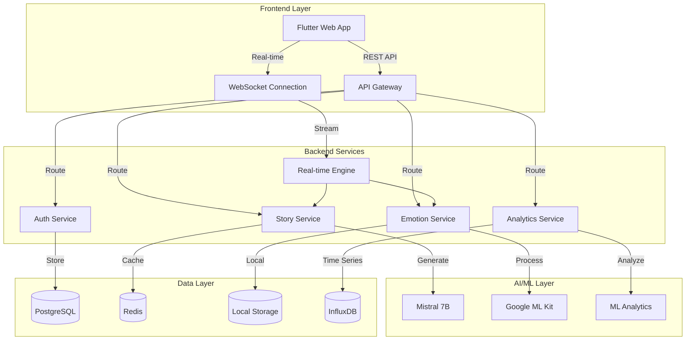

## Frontend Architecture

### Flutter Web Application

#### Layer Structure

```
lib/
├── main.dart                 # Application entry point
├── app/                      # Application configuration
│   ├── app.dart             # Main app widget
│   ├── router.dart          # Navigation routing
│   └── theme.dart           # Application theming
├── core/                     # Core business logic
│   ├── models/              # Data models
│   ├── services/            # Business logic services
│   ├── utils/               # Utility functions
│   └── constants/           # Application constants
├── features/                 # Feature modules
│   ├── emotion_engine/      # Emotion detection feature
│   ├── story_tutor/         # Story generation feature
│   ├── communication/       # Communication tools
│   ├── dashboard/           # Analytics dashboard
│   └── shared/              # Shared feature components
└── shared/                   # Shared application components
    ├── widgets/             # Reusable UI components
    ├── themes/              # Theme configurations
    └── providers/           # State management
```

#### State Management Pattern

Using **Riverpod** for predictable state management:

```dart
// Provider Definition
final emotionServiceProvider = Provider<EmotionService>((ref) {
  return EmotionService.instance;
});

final currentEmotionProvider = StreamProvider<EmotionalState?>((ref) {
  final service = ref.watch(emotionServiceProvider);
  return service.emotionStream;
});

// Consumer Usage
class EmotionDisplay extends ConsumerWidget {
  @override
  Widget build(BuildContext context, WidgetRef ref) {
    final emotionAsync = ref.watch(currentEmotionProvider);
    
    return emotionAsync.when(
      data: (emotion) => EmotionCard(emotion: emotion),
      loading: () => CircularProgressIndicator(),
      error: (error, stack) => ErrorDisplay(error: error),
    );
  }
}
```

#### Component Architecture

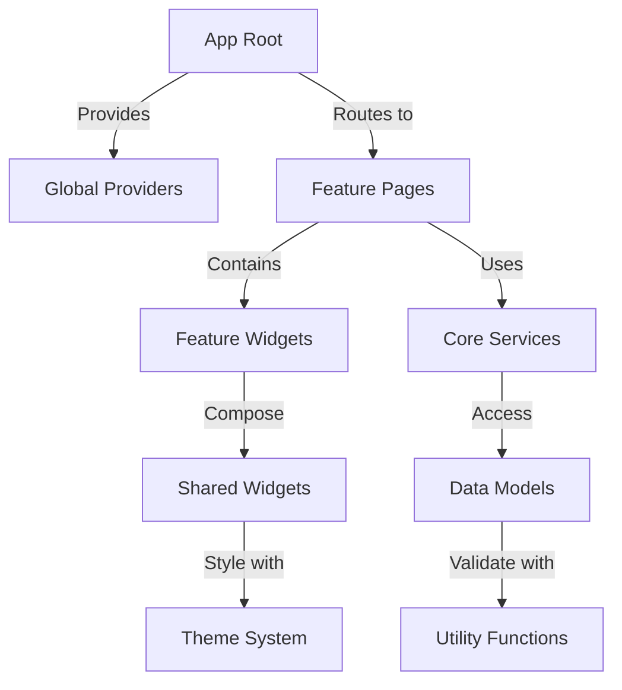

### Design Patterns

#### 1. Feature-Based Organization

Each feature is self-contained with its own:
- **Presentation Layer**: Pages and widgets
- **Business Logic**: Services and providers
- **Data Layer**: Models and repositories

```dart
// Feature structure example
features/emotion_engine/
├── presentation/
│   ├── pages/
│   │   └── emotion_engine_page.dart
│   └── widgets/
│       ├── emotion_display.dart
│       └── mood_analytics.dart
├── domain/
│   ├── entities/
│   │   └── emotion_state.dart
│   └── repositories/
│       └── emotion_repository.dart
└── data/
    ├── models/
    │   └── emotion_model.dart
    └── sources/
        └── emotion_api.dart
```

#### 2. Repository Pattern

Abstraction layer for data access:

```dart
abstract class EmotionRepository {
  Stream<EmotionalState> get emotionStream;
  Future<void> saveEmotion(EmotionalState emotion);
  Future<List<EmotionalState>> getHistory(String studentId);
}

class EmotionRepositoryImpl implements EmotionRepository {
  final EmotionLocalDataSource _localDataSource;
  final EmotionRemoteDataSource _remoteDataSource;
  
  EmotionRepositoryImpl(this._localDataSource, this._remoteDataSource);
  
  @override
  Stream<EmotionalState> get emotionStream => 
      _localDataSource.emotionStream;
  
  @override
  Future<void> saveEmotion(EmotionalState emotion) async {
    await _localDataSource.saveEmotion(emotion);
    await _remoteDataSource.saveEmotion(emotion);
  }
}
```

#### 3. Service Locator Pattern

Dependency injection using Riverpod:

```dart
final emotionRepositoryProvider = Provider<EmotionRepository>((ref) {
  return EmotionRepositoryImpl(
    ref.watch(emotionLocalDataSourceProvider),
    ref.watch(emotionRemoteDataSourceProvider),
  );
});

final emotionServiceProvider = Provider<EmotionService>((ref) {
  return EmotionService(ref.watch(emotionRepositoryProvider));
});
```

## Backend Architecture

### Microservices Design

#### Service Breakdown

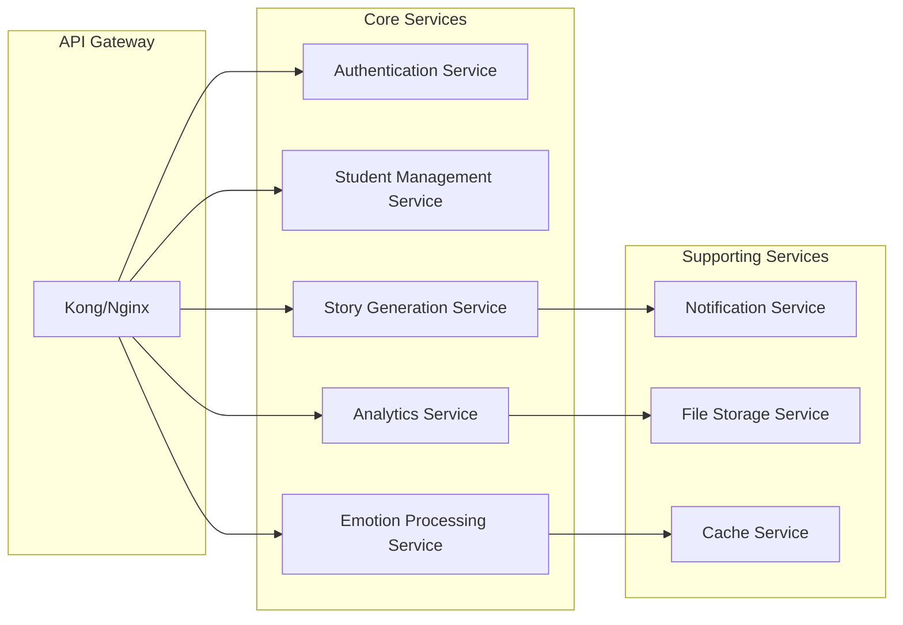

#### Service Responsibilities

1. **Authentication Service**
   - User authentication and authorization
   - JWT token management
   - Role-based access control
   - Session management

2. **Student Management Service**
   - Student profile CRUD operations
   - Cognitive profile management
   - Learning preferences
   - Progress tracking

3. **Story Generation Service**
   - AI-powered story creation
   - Template management
   - Content adaptation
   - Educational objective mapping

4. **Emotion Processing Service**
   - Real-time emotion analysis
   - Mood pattern detection
   - Intervention recommendations
   - Historical data processing

5. **Analytics Service**
   - Learning analytics
   - Progress reporting
   - Predictive modeling
   - Dashboard data aggregation

### Data Architecture

#### Database Design

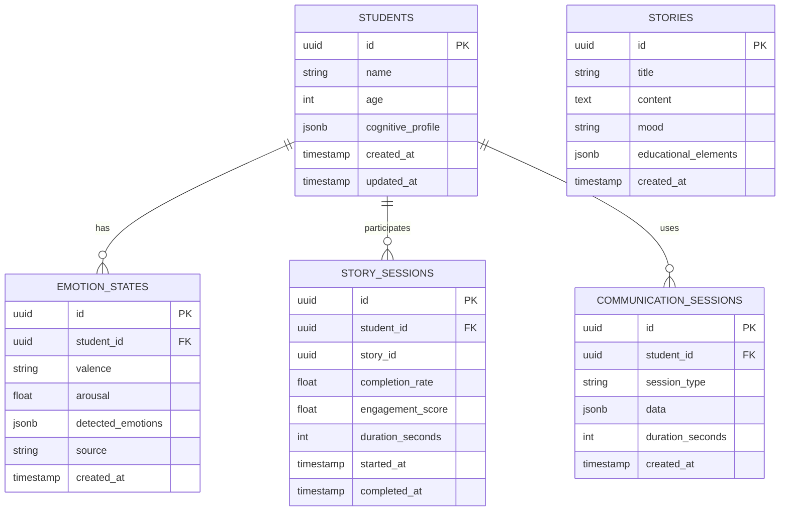

#### Data Flow Architecture

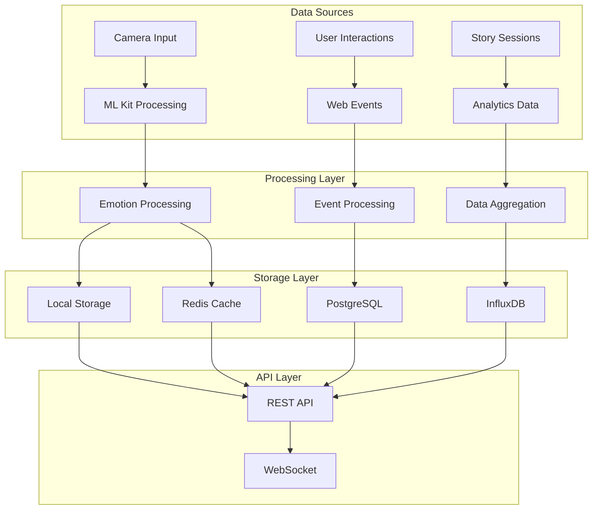

## AI/ML Architecture

### Emotion Detection Pipeline

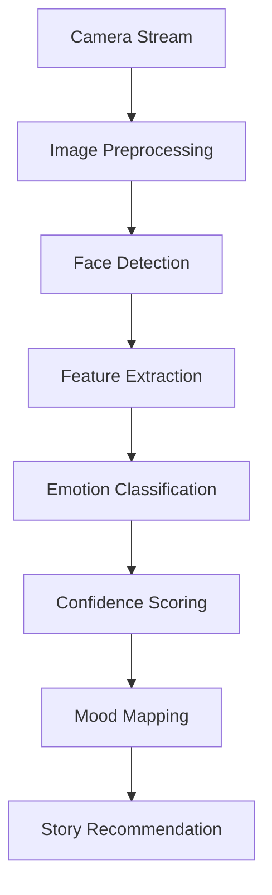

#### ML Kit Integration

```dart
class EmotionDetectionPipeline {
  final FaceDetector _faceDetector;
  final EmotionClassifier _emotionClassifier;
  
  Future<EmotionalState?> processFrame(CameraImage image) async {
    // Step 1: Detect faces
    final faces = await _faceDetector.processImage(
      InputImage.fromCameraImage(image)
    );
    
    if (faces.isEmpty) return null;
    
    // Step 2: Extract facial features
    final primaryFace = _selectPrimaryFace(faces);
    final features = await _extractFeatures(primaryFace);
    
    // Step 3: Classify emotions
    final emotions = await _emotionClassifier.classify(features);
    
    // Step 4: Create emotional state
    return _createEmotionalState(emotions);
  }
}
```

### Story Generation Architecture

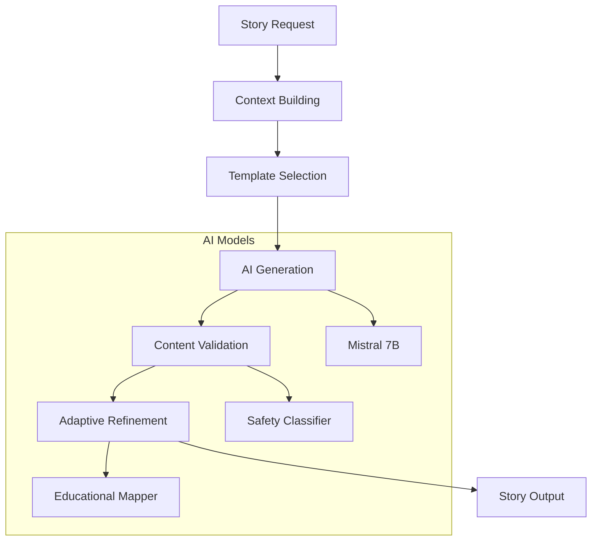

#### Mistral Integration

```python
class StoryGenerator:
    def __init__(self, mistral_client: MistralClient):
        self.client = mistral_client
        
    async def generate_story(
        self, 
        student_profile: StudentProfile,
        mood: StoryMood,
        educational_objective: str
    ) -> Story:
        
        # Build context
        context = self._build_context(student_profile, mood)
        
        # Generate with Mistral
        prompt = self._create_prompt(context, educational_objective)
        response = await self.client.chat.complete(
            model="mistral-7b-instruct",
            messages=[{"role": "user", "content": prompt}],
            temperature=0.7
        )
        
        # Validate and adapt
        story_content = response.choices[0].message.content
        validated_story = await self._validate_content(story_content)
        
        return self._create_story_object(validated_story, mood)
```

## Security Architecture

### Authentication & Authorization

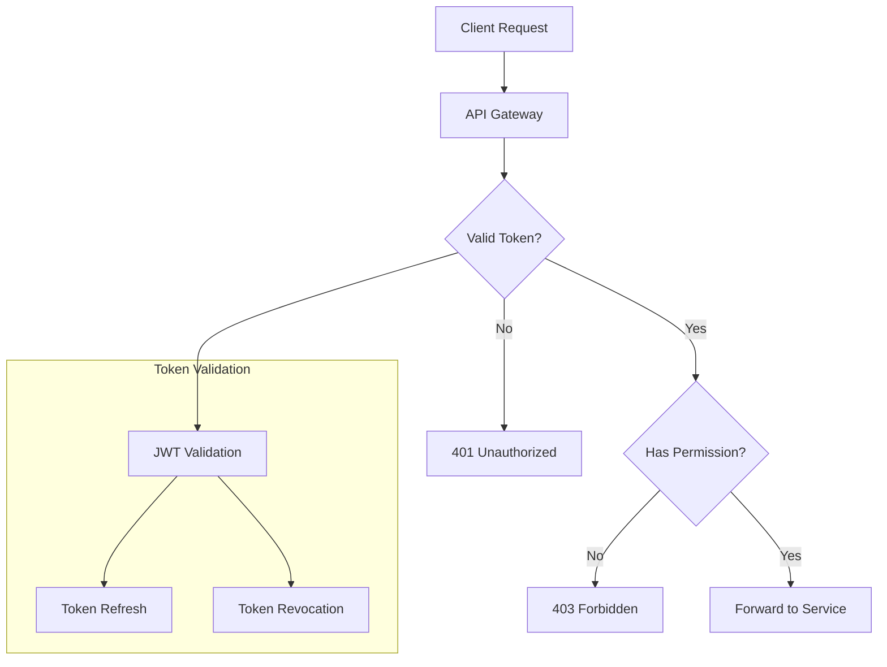

### Data Privacy

#### Local-First Architecture

```dart
class PrivacyFirstDataManager {
  // Emotion data stays local
  final LocalEmotionStorage _localEmotion;
  
  // Only aggregated analytics sent to server
  final AnalyticsService _analytics;
  
  Future<void> processEmotion(EmotionalState emotion) async {
    // Store locally
    await _localEmotion.save(emotion);
    
    // Send only anonymized analytics
    final anonymizedData = _anonymize(emotion);
    await _analytics.track(anonymizedData);
  }
  
  Map<String, dynamic> _anonymize(EmotionalState emotion) {
    return {
      'valence': emotion.valence,
      'arousal_range': _discretizeArousal(emotion.arousal),
      'session_id': _generateSessionId(),
      // No student ID or personal data
    };
  }
}
```

## Performance Architecture

### Caching Strategy

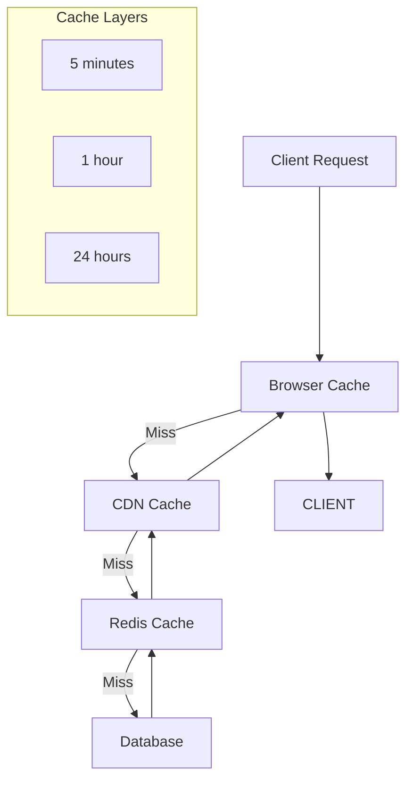

### Real-time Processing

```dart
class RealTimeEmotionProcessor {
  final StreamController<EmotionalState> _controller;
  Timer? _processingTimer;
  
  void startProcessing() {
    _processingTimer = Timer.periodic(
      Duration(milliseconds: 2000), // 2-second intervals
      (_) => _processCurrentFrame(),
    );
  }
  
  Future<void> _processCurrentFrame() async {
    if (_isProcessing) return; // Skip if already processing
    
    _isProcessing = true;
    try {
      final emotion = await _detectEmotion();
      if (emotion != null) {
        _controller.add(emotion);
        await _updateRecommendations(emotion);
      }
    } finally {
      _isProcessing = false;
    }
  }
}
```

## Scalability Architecture

### Horizontal Scaling

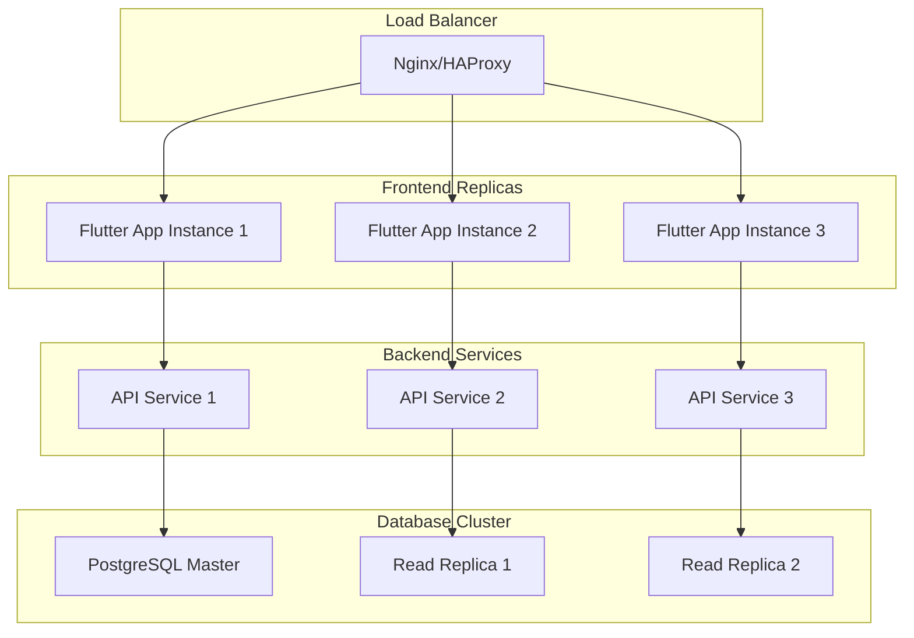

### Auto-scaling Configuration

```yaml
# Kubernetes HPA configuration
apiVersion: autoscaling/v2
kind: HorizontalPodAutoscaler
metadata:
  name: neurolearn-api-hpa
spec:
  scaleTargetRef:
    apiVersion: apps/v1
    kind: Deployment
    name: neurolearn-api
  minReplicas: 2
  maxReplicas: 10
  metrics:
  - type: Resource
    resource:
      name: cpu
      target:
        type: Utilization
        averageUtilization: 70
  - type: Resource
    resource:
      name: memory
      target:
        type: Utilization
        averageUtilization: 80
```

## Deployment Architecture

### Container Strategy

```dockerfile
# Multi-stage build for Flutter Web
FROM node:18-alpine as flutter-build
WORKDIR /app
COPY pubspec.yaml pubspec.lock ./
RUN flutter pub get
COPY . .
RUN flutter build web --release

FROM nginx:alpine
COPY --from=flutter-build /app/build/web /usr/share/nginx/html
COPY nginx.conf /etc/nginx/nginx.conf
EXPOSE 80
CMD ["nginx", "-g", "daemon off;"]
```

### Infrastructure as Code

```yaml
# Docker Compose for development
version: '3.8'
services:
  frontend:
    build: ./frontend
    ports:
      - "8087:80"
    depends_on:
      - api
      
  api:
    build: ./backend
    ports:
      - "8000:8000"
    environment:
      - DATABASE_URL=postgresql://user:pass@db:5432/neurolearn
    depends_on:
      - db
      - redis
      
  db:
    image: postgres:15-alpine
    environment:
      POSTGRES_DB: neurolearn
      POSTGRES_USER: user
      POSTGRES_PASSWORD: pass
    volumes:
      - postgres_data:/var/lib/postgresql/data
      
  redis:
    image: redis:7-alpine
    ports:
      - "6379:6379"
      
volumes:
  postgres_data:
```

## Monitoring & Observability

### Application Metrics

```dart
class MetricsCollector {
  static final _instance = MetricsCollector._();
  static MetricsCollector get instance => _instance;
  
  void trackEmotionDetection(EmotionalState emotion) {
    // Track detection latency
    _trackLatency('emotion_detection', emotion.processingTime);
    
    // Track emotion distribution
    _trackCounter('emotion_detected', {
      'emotion': emotion.primaryEmotion,
      'confidence': emotion.confidence.toString(),
    });
  }
  
  void trackStoryGeneration(String storyId, Duration generationTime) {
    _trackLatency('story_generation', generationTime);
    _trackCounter('story_generated');
  }
}
```

### Health Checks

```python
@app.get("/health")
async def health_check():
    checks = {
        "database": await check_database(),
        "redis": await check_redis(),
        "mistral_api": await check_mistral_api(),
        "ml_kit": check_ml_kit_availability(),
    }
    
    healthy = all(checks.values())
    status_code = 200 if healthy else 503
    
    return JSONResponse(
        content={"status": "healthy" if healthy else "unhealthy", "checks": checks},
        status_code=status_code
    )
```

## Future Architecture Considerations

### Edge Computing

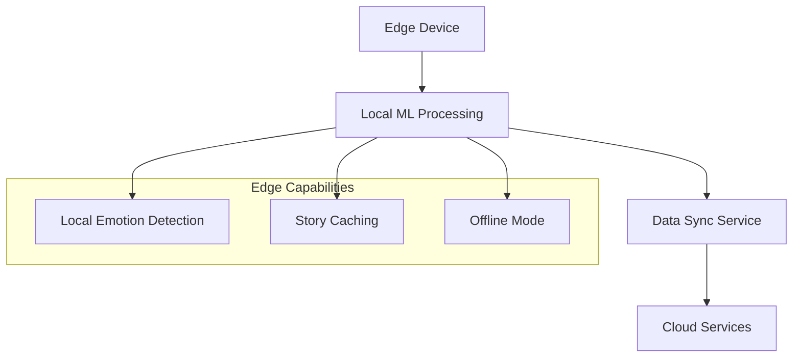

### WebAssembly Integration

```dart
// Future: WASM-based ML inference
import 'dart:html' as html;
import 'package:js/js.dart';

@JS('loadEmotionModel')
external Future<void> loadEmotionModel();

@JS('detectEmotion')
external dynamic detectEmotionWasm(dynamic imageData);

class WasmEmotionDetector {
  static bool _initialized = false;
  
  static Future<void> initialize() async {
    if (!_initialized) {
      await loadEmotionModel();
      _initialized = true;
    }
  }
  
  Future<EmotionalState?> detectEmotion(html.ImageData imageData) async {
    final result = detectEmotionWasm(imageData);
    return EmotionalState.fromWasmResult(result);
  }
}
```

---

*This architecture documentation is living and evolves with the system. Last updated: January 15, 2024* 